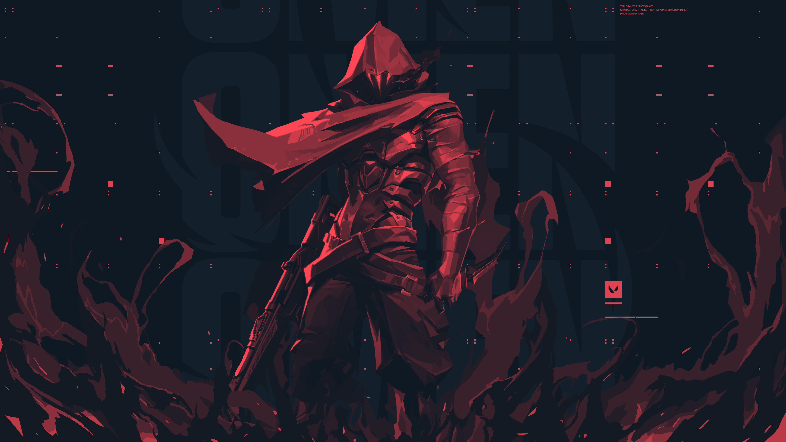
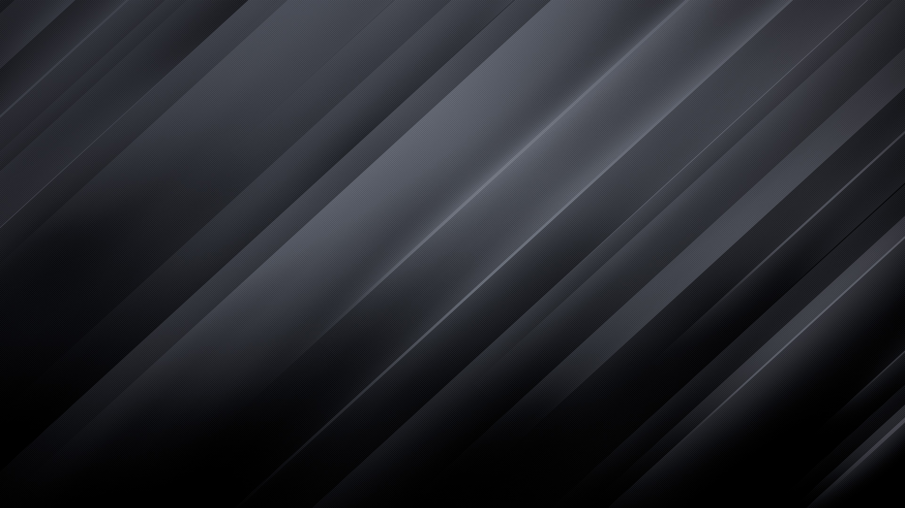

    <h1><a href="https://github.com/mobinjavari/Wallpapers">wallpapers</a></h1>
    
A collection of the best wallpapers 🌠

    
Anthology of my lovely pictures (do not credit me, I'm not their owner) ❗
 
    

        
Toggle Preaview
 
         
         
         
         
         
         
         
         
         
         
         
         
        
<a href="https://github.com/mobinjavari/wallpapers/tree/main/wallpapers">more wallpapers ...</a>

    
  
    
    

 
